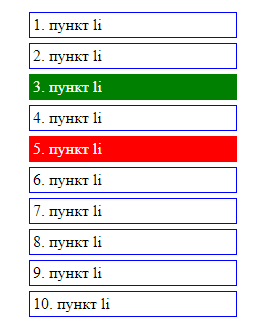
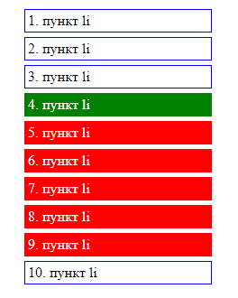
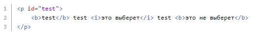
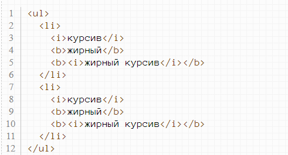
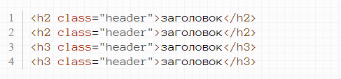
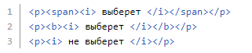

[Выполненное задание в html](https://ivlord.github.io/Web/Labs1_12/Lab02/solution/index.html)

**Лабораторная работа №2**

1. Повторите страницу по образцу (при наведении курсора мыши на любой элемент списка, текущий элемент окрашивается в зеленый цвет, а элемент через один от него - в красный)

2. Повторите страницу по образцу (при наведении курсора мыши на любой элемент списка, текущий элемент окрашивается в зеленый цвет, а все элементы ниже кроме последнего - в красный)

Для следующих заданий нужно создать отдельный css файл, в котором перечислить все селекторы. Создавать соответствующий html-файл не обязательно, по желанию.

3. Сделайте селектор, который выберет все абзацы  **\<p\>**  с классом  **test**  из дивов  **\<div\>**  с классом  **hello**.

4. Сделайте селектор, который выберет все абзацы  **\<p\>**  с классом  **test**  и одновременно все элементы с классом  **hello**.

5. Сделайте селектор, который выберет все  **\<a\>** , которые лежат непосредственно внутри  **\<p\>**  и одновременно все  **\<a\>**  с классом  **test**.

6. Сделайте селектор, который выберет все  **\<i\>** , которые лежат непосредственно после  **\<b\>**  из элемента с  **id=test**.

Пример HTML для проверки:

7. Дан следующий код:

Покрасьте в красный цвет только те теги b, которые являются непосредственными потомками тегов li.

8. Дан следующий код:

Покрасьте все h2 с классом header в красный цвет, а все h3 с этим классом - в синий.

9. Сделайте селектор, который выберет все абзацы  **\<p\>**  идущие после  **\<h2\>**  из элемента с  **id=test**.

10. Сделайте селектор, который выберет все  **\<i\>** , лежащие внутри любых элементов, лежащих внутри абзаца  **\<p\>**.

Пример HTML для проверки:

11. Сделайте селектор, который выберет все абзацы  **\<p\>**  с атрибутом  **title** , в значении которого есть слово  **'привет'**.

[Выполненное задание в html](https://ivlord.github.io/Web/Labs1_12/Lab02/solution/index.html)